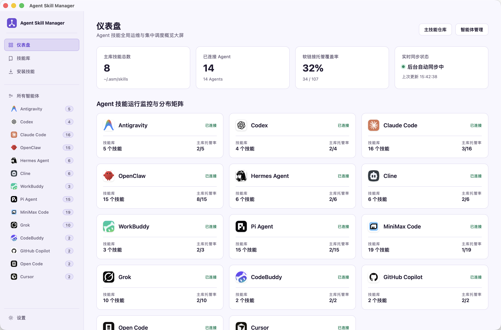
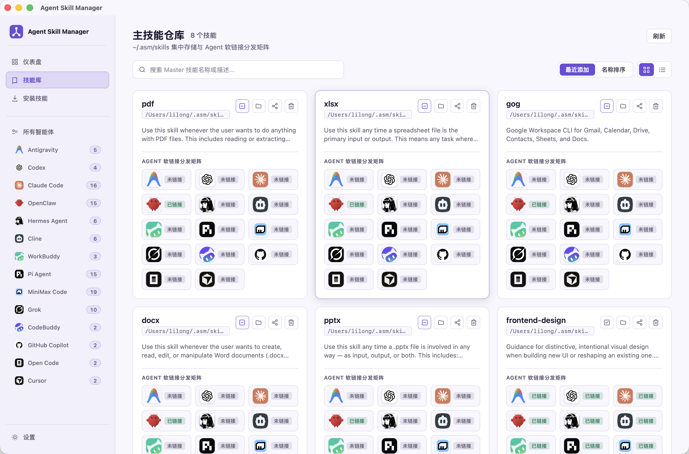
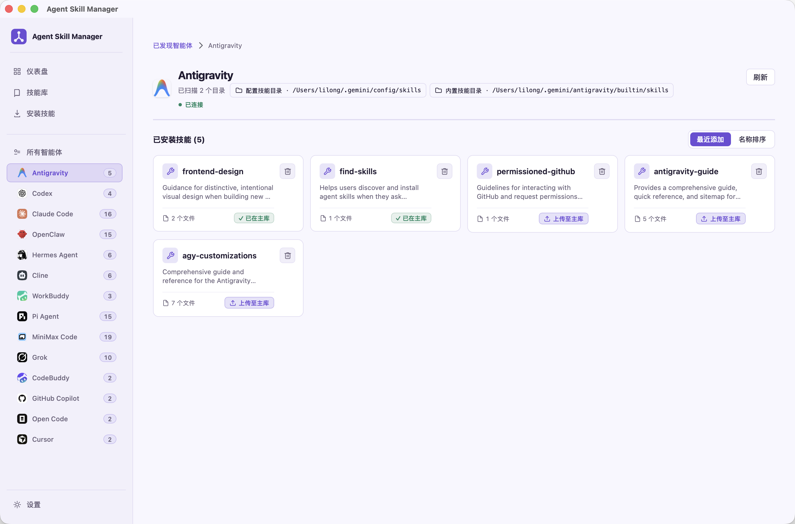

<div align="center">

# Agent Skill Manager

**一个本地优先的 AI Agent Skills 管理器。一次整理，按需分发给你使用的每个 Agent。**

**A local-first manager for AI Agent Skills. Organize once, then distribute to the agents you use.**

[](https://tauri.app/) [](https://react.dev/) [](LICENSE)

中文 · [English](#english)

</div>

<table>
  <tr>
    <td width="33.33%" align="center">
      <a href="docs/images/dashboard.png"></a><br />
      <sub><b>Dashboard / 仪表盘</b><br />Monitor every Agent at a glance / 跨 Agent 运行状态一目了然</sub>
    </td>
    <td width="33.33%" align="center">
      <a href="docs/images/skill-library.png"></a><br />
      <sub><b>Master Skill Library / 主技能库</b><br />Manage and distribute Skills centrally / 集中管理并分发 Skills</sub>
    </td>
    <td width="33.33%" align="center">
      <a href="docs/images/antigravity.png"></a><br />
      <sub><b>Antigravity Agent / Antigravity 智能体</b><br />Browse installed Skills by Agent / 按 Agent 查看已安装 Skills</sub>
    </td>
  </tr>
</table>

## 为什么使用 ASM？

当你同时使用 Claude Code、Codex、MiniMax Code、Cursor 等多个 AI Agent 时，Skills 往往散落在不同目录：难以发现、难以比较，也容易重复维护。Agent Skill Manager（ASM）将这些本地 Skills 汇集到一个主技能库中，并通过链接按需分发给各个 Agent。

<table>
  <tr>
    <td width="33%">
      <h3>🔎 找得到</h3>
      <p>扫描本机 Agent 的 Skills 目录，集中查看已发现的 Skills、元数据、文件数量与链接状态。</p>
    </td>
    <td width="33%">
      <h3>🗂️ 管得住</h3>
      <p>使用本地主技能库统一收纳、安装、导出与整理 Skills，避免同一能力分散维护。</p>
    </td>
    <td width="33%">
      <h3>🔗 发得准</h3>
      <p>将一个 Skill 链接到你选择的多个 Agent；各 Agent 始终使用同一份主库内容。</p>
    </td>
  </tr>
</table>

## 功能

### 发现与对比

- 扫描已支持 Agent 的默认 Skills 目录，以及在设置中配置的自定义目录。
- 按 Agent 浏览本机已安装的 Skills，并查看描述、文件数、指纹与链接目标。
- 在 Agent Matrix 中对比同一 Skill 在不同 Agent 中的状态，包括缺失、已存在、冲突与未知。

### 收纳与安装

- 在默认位于 `~/.asm/skills` 的本地主技能库中统一管理 Skills。
- 将 Agent 现有的本地 Skill 导入主库，并处理同名冲突。
- 从本地文件夹、ZIP 压缩包或 Git 仓库安装 Skill；多 Skill 仓库可先选择要安装的 Skill。
- 搜索、排序、查看详情、导出为 ZIP，或打开 Skill 的本地目录。

### 分发与配置

- 将主库中的 Skill 一键链接至一个或多个 Agent。
- 设置 Agent 的显示顺序、显示/隐藏状态及自定义 Skills 目录。
- 提供中英文界面、主题设置、托盘入口与应用更新能力。

## 工作方式

1. 启动 ASM，扫描已检测到的 Agent 及其 Skills 目录。
2. 在 Agent 视图或 Agent Matrix 中了解已有 Skills 的分布情况。
3. 将本地 Skill 导入主库，或从本地文件夹、ZIP、Git 仓库安装新 Skill。
4. 从主库选择目标 Agent 分发；ASM 在对应 Skills 目录创建本地链接。

## 支持的 Agent

ASM 当前注册了 25 个 Agent 适配器：

Claude Code、Cline、CodeBuddy、GitHub Copilot、Droid、Qoder、Qwen Code、Hermes Agent、OpenClaw、WorkBuddy、Kimi Code CLI、**MiniMax Code**、Augment、Roo Code、Windsurf、Codex、Antigravity、Pi Agent、Oh My Pi（OPM）、Grok、Kiro CLI、TRAE、TRAE CN、Open Code 和 Cursor。

检测以各 Agent 的本地 Skills 目录为依据。你可以在设置中为已检测到的 Agent 指定自定义目录。

## 本地优先与文件安全

ASM 在本地文件系统中管理 Skills，主技能库默认存放在 `~/.asm/skills`。它不提供云同步或分析服务。

- 导入外部 Skill 链接时，ASM 会将目标内容复制到主库，只把当前 Agent 的链接改指向主库；外部目标不会被修改。
- 删除主库 Skill 时，ASM 只删除指向该主库副本的受管理链接，不会删除无关的 Agent Skills 或外部链接目标。
- 移除 Agent 的 Skill 链接时，只移除链接本身，不会跟随或删除其目标内容。
- 通过 Git 来源安装时，ASM 会将仓库拉取到本地以准备主库副本。

在导入、安装、分发或删除前，请确认界面中的来源与目标路径。

## 从源码运行

### 前置条件

- Rust 1.77 或更高版本
- Node.js 22 或更高版本
- pnpm 9 或更高版本
- 支持 Tauri 2 的桌面环境；Linux 还需安装 [Tauri 系统依赖](https://v2.tauri.app/start/prerequisites/)

```bash
pnpm install
pnpm tauri:dev
```

该命令会启动 Vite 前端和 Tauri 桌面窗口。

### 开发命令

| 命令 | 用途 |
| --- | --- |
| `pnpm dev` | 启动 Vite 前端开发服务器。 |
| `pnpm tauri:dev` | 启动完整的 Tauri 桌面应用开发环境。 |
| `pnpm test` | 运行 Vitest 前端测试。 |
| `pnpm build` | 类型检查并构建生产前端资源。 |
| `pnpm tauri:build` | 为当前平台构建 Tauri 应用包。 |
| `cargo test --lib --manifest-path src-tauri/Cargo.toml` | 运行 Rust 库测试。 |

## macOS 临时安装说明

Release 同时提供 Apple Silicon（`darwin-aarch64.dmg`）和 Intel（`darwin-x86_64.dmg`）安装包。下载与芯片架构相符的 DMG，将应用拖入“应用程序”目录即可安装。

当前版本使用临时 ad-hoc 签名，尚未接入 Apple Developer ID 签名与公证。因此如果 Gatekeeper 提示无法验证开发者，请按住 Control 点击应用，选择“打开”，再在确认窗口中选择“打开”；也可前往“系统设置 → 隐私与安全性”允许打开。正式签名与公证接入后，该手动步骤将被移除。

## 参与贡献

欢迎提交 Issue 或 Pull Request。请保持改动聚焦、让文档与实际行为一致，并在提交前运行与改动相关的检查：

```bash
pnpm test
pnpm build
cargo test --lib --manifest-path src-tauri/Cargo.toml
```

## 许可证

本项目采用 [MIT License](LICENSE) 开源。

---

<a id="english"></a>

# Agent Skill Manager — English

## Why ASM?

When you use several AI agents—such as Claude Code, Codex, MiniMax Code, and Cursor—Skills tend to end up in separate directories. They become difficult to discover, compare, and maintain. Agent Skill Manager (ASM) collects those local Skills in one master library and distributes them to the agents you choose through local links.

<table>
  <tr>
    <td width="33%">
      <h3>🔎 Discover</h3>
      <p>Scan local Skill directories and inspect discovered Skills, their metadata, file counts, and link status in one place.</p>
    </td>
    <td width="33%">
      <h3>🗂️ Organize</h3>
      <p>Keep Skills in a local master library for consistent installation, export, and maintenance.</p>
    </td>
    <td width="33%">
      <h3>🔗 Distribute</h3>
      <p>Link one Skill to any number of selected agents, all backed by the same master copy.</p>
    </td>
  </tr>
</table>

## Features

### Discover and compare

- Scan the default Skill locations of supported agents, plus custom directories configured in Settings.
- Browse the Skills installed for each agent, including their descriptions, file counts, fingerprints, and link targets.
- Compare a Skill across agents in the Agent Matrix, with missing, present, conflict, and unknown states.

### Collect and install

- Maintain one local master Skill library, located at `~/.asm/skills` by default.
- Import an existing local Skill from an agent into the master library and resolve naming conflicts.
- Install a Skill from a local directory, ZIP archive, or Git repository; select a specific Skill when a repository contains more than one.
- Search, sort, inspect, export, and open Skills locally.

### Distribute and configure

- Link a master Skill to one or more agents.
- Control agent visibility and ordering, and configure custom Skill directories.
- Use the application in English or Simplified Chinese, with theme settings, tray access, and app updates.

## How it works

1. Start ASM to scan detected agents and their Skill directories.
2. Review the distribution of existing Skills in an agent view or the Agent Matrix.
3. Import a local Skill into the master library, or install one from a local folder, ZIP archive, or Git repository.
4. Choose target agents from the master library. ASM creates local links in their corresponding Skill directories.

## Supported agents

ASM currently registers adapters for 25 agents:

Claude Code, Cline, CodeBuddy, GitHub Copilot, Droid, Qoder, Qwen Code, Hermes Agent, OpenClaw, WorkBuddy, Kimi Code CLI, **MiniMax Code**, Augment, Roo Code, Windsurf, Codex, Antigravity, Pi Agent, Oh My Pi (OPM), Grok, Kiro CLI, TRAE, TRAE CN, Open Code, and Cursor.

Detection is based on each agent's local Skill directory. You can configure a custom directory for every detected agent in Settings.

## Local-first and safe by design

ASM manages Skills on the local filesystem. The master library lives at `~/.asm/skills` by default; the app does not provide cloud synchronization or analytics.

- When importing an external Skill link, ASM copies its target into the master library and redirects only the current agent link. The external target remains unchanged.
- Deleting a master Skill removes only that master copy and ASM-managed links that point to it. Unrelated agent Skills and external link targets are preserved.
- Removing an agent Skill link removes the link itself; ASM never follows or deletes its target.
- Installing from Git clones the repository locally to prepare the master-library copy.

Review the source and destination paths shown in the app before importing, installing, distributing, or deleting a Skill.

## Run from source

### Prerequisites

- Rust 1.77 or newer
- Node.js 22 or newer
- pnpm 9 or newer
- A desktop environment supported by Tauri 2. On Linux, also install the [Tauri system dependencies](https://v2.tauri.app/start/prerequisites/).

```bash
pnpm install
pnpm tauri:dev
```

This starts the Vite frontend and the Tauri desktop window.

### Development commands

| Command | Purpose |
| --- | --- |
| `pnpm dev` | Start the Vite frontend development server. |
| `pnpm tauri:dev` | Start the complete Tauri desktop app in development mode. |
| `pnpm test` | Run the Vitest frontend suite. |
| `pnpm build` | Type-check and build the production frontend bundle. |
| `pnpm tauri:build` | Build a Tauri application bundle for the current platform. |
| `cargo test --lib --manifest-path src-tauri/Cargo.toml` | Run the Rust library tests. |

## Temporary macOS installation instructions

Each release provides installers for Apple Silicon (`darwin-aarch64.dmg`) and Intel (`darwin-x86_64.dmg`) Macs. Download the DMG matching your Mac, then drag the app into Applications.

The current release uses temporary ad-hoc signing and is not yet signed with an Apple Developer ID or notarized. If Gatekeeper cannot verify the developer, Control-click the app, select **Open**, then confirm **Open** again. You can also allow it in **System Settings → Privacy & Security**. This manual step will be removed after Developer ID signing and notarization are added.

## Contributing

Issues and focused pull requests are welcome. Keep documentation aligned with implemented behavior, and run the checks relevant to your change before submitting:

```bash
pnpm test
pnpm build
cargo test --lib --manifest-path src-tauri/Cargo.toml
```

## License

Licensed under the [MIT License](LICENSE).
